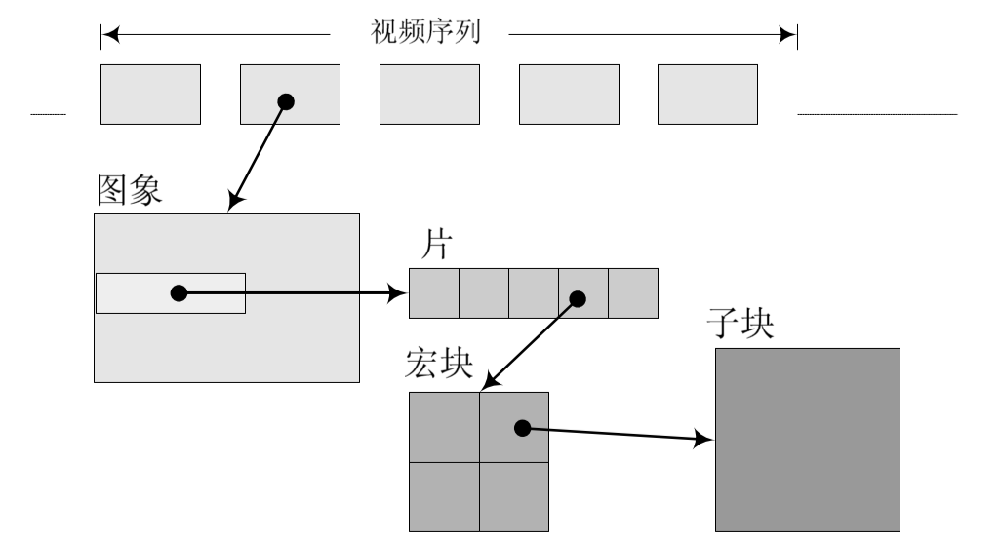

# H.264 的视频格式

# 码流的划分

H.264 的功能分为两层，即视频编码层（VCL）和网络提取层（NAL，Network Abstraction Layer）。
- VCL 数据即编码处理的输出，它表示被压缩编码后的视频数据序列。在 VCL 数据传输或存储之前，这些编码的 VCL 数据，先被映射或封装进 NAL 单元中。
- 每个 NAL 单元包括一个原始字节序列负荷（RBSP）、一组对应于视频编码数据的 NAL 头信息。

## 场

视频的一场或一帧可用来产生一个编码图像。在电视中，为减少大面积闪烁现象，把一帧分成两个隔行的场，把一帧分成两个隔行的场

## 片组

当使用 FMO 时，图像根据不同宏块需要的扫描方式的不同，划分成多个片组，这样一来，不同片组的扫描方向和顺序互不影响。

## 片

一个视频图像可编码成一个或更多个片，每片包含至少一个宏块（MB）

设片的目的是为了限制误码的扩散和传输。编码片相互间是独立的，某片的预测不能以其它片中的宏块为参考图像，这样某一片中的预测误差才不会传播到其它片中去。

编码片共有 5 种不同类型，除去基本的 I 片、P 片、B 片外，还有扩展的 SP 片和 SI 片。其中 SP（切换 P）是用于不同编码流之间的切换；它包含 P 和/或 I 宏块。它是扩展档次中必须具有的切换，它包含了一种特殊类型的编码宏块，叫做 SI 宏块，SI 也是扩展档次中的必备功能。

## 宏块

一个编码图像通常划分成若干宏块组成，一个宏块由一个 16×16 亮度像素和附加的一个 8×8 Cb 和一个 8×8 Cr 彩色像素块组成。每个图象中，若干宏块被排列成片的形式。 

I 片只包含 I 宏块，P 片可包含 P 和 I 宏块，而 B 片可包含 B 和 I 宏块。

I 宏块利用从当前片中已解码的像素作为参考进行帧内预测；

P 宏块利用前面已编码图象作为参考图象进行帧内预测；

B 宏块则利用双向的参考图象（当前和未来的已编码图象帧）进行帧内预测。

## 子宏块

一个帧内编码的宏块可进一步作宏块的分割：即 16×16、16×8、8×16 或 8×8 亮度像素块（以及附带的彩色像素）；

如果选了 8×8 的子宏块，则可再分成各种子宏块的分割，其尺寸为 8×8、8×4、4×8 或 4×4 亮度像素块（以及附带的彩色像素）。